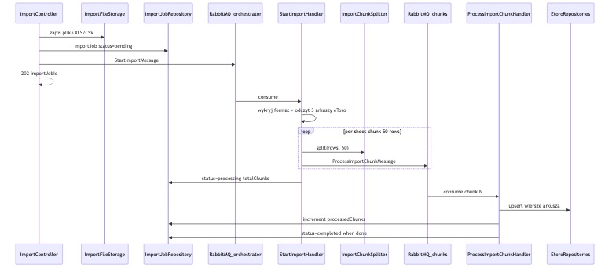

# Moduł DataImport

Import plików XLS/XLSX/CSV (np. wyciąg eToro) przez HTTP. Orkiestrator na RabbitMQ dzieli plik na chunki po 50 wierszy i wysyła je do osobnych workerów.

## Architektura przepływu



1. **ImportController** zapisuje plik i tworzy `ImportJob` ze statusem `pending`.
2. Na kolejkę `import_orchestrator` trafia `StartImportMessage`.
3. **StartImportHandler** (orkiestrator) czyta plik, dzieli wiersze chunkami po 50 i dispatchuje `ProcessImportChunkMessage`.
4. **ProcessImportChunkHandler** (worker) zapisuje wiersze do tabel eToro i aktualizuje postęp joba.

## Kluczowe komponenty

### 1. Upload HTTP

`ImportController` (`Infrastructure/Http/Controller/ImportController.php`):

- `POST /api/imports` — `multipart/form-data`: pole `file`, opcjonalnie `importType` (domyślnie `etoro_statement`)
- Walidacja: rozszerzenie `csv|xls|xlsx`, max rozmiar 20 MB
- Zapis pliku lokalnie, utworzenie `ImportJob`, dispatch `StartImportMessage` na kolejkę orkiestratora
- Odpowiedź: `{ "importJobId": "...", "status": "queued" }`
- `GET /api/imports/{id}` — status joba (postęp chunków)

### 2. Orkiestrator (`StartImportHandler`)

Odpowiedzialności:

1. Ustaw `ImportJob` na `processing`
2. Wywołaj `EtoroStatementImportFileReader` — zwraca 3 kolekcje wierszy dla arkuszy:
   - `closed_positions` — Pozycje zamknięte
   - `account_activity` — Aktywność na rachunku
   - `dividends` — Dywidendy
3. Dla każdego arkusza: `ImportChunkSplitter::split($rows, 50)` → dispatch `ProcessImportChunkMessage`
4. Zapisz `totalChunks` w jobie

### 3. Worker chunka (`ProcessImportChunkHandler`)

- Mapuje wiersze na encje domenowe (3 mappery per arkusz)
- Zapis batch przez repozytoria Doctrine
- Inkrementuje `processedChunks` w `ImportJob`
- Przy błędzie wiersza: log + zapis błędu w jobie (job kontynuuje)
- Gdy `processedChunks === totalChunks` → `status=completed` lub `failed` (gdy są błędy)

### 4. Serwis chunkowania

`ImportChunkSplitter` — dzieli tablicę wierszy na chunki po 50 (konfigurowalne przez `%data_import.chunk_size%`).

## Struktura katalogów

```
src/DataImport/
├── Domain/
├── Application/
│   ├── Message/
│   ├── Handler/
│   ├── Service/
│   └── Mapper/
├── Infrastructure/
│   ├── Http/
│   ├── Persistence/
│   ├── File/
│   └── Reader/
└── docs/
```

## Kolejki RabbitMQ

| Kolejka | Wiadomość | Handler | Cel |
|---------|-----------|---------|-----|
| `import_orchestrator` | `StartImportMessage` | `StartImportHandler` | 1 consumer — czyta plik, dzieli, dispatchuje |
| `import_chunks` | `ProcessImportChunkMessage` | `ProcessImportChunkHandler` | N consumerów — równoległe przetwarzanie chunków |

```bash
docker compose exec php php bin/console messenger:setup-transports
docker compose exec -d php php bin/console messenger:consume import_orchestrator -vv
docker compose exec -d php php bin/console messenger:consume import_chunks -vv
```

## Arkusze eToro

| Arkusz | Klucz | Kolumny (approx.) |
|--------|-------|-------------------|
| Pozycje zamknięte | `closed_positions` | 22 |
| Aktywność na rachunku | `account_activity` | 11 |
| Dywidendy | `dividends` | 12 |

## API

Upload (wymaga JWT):

```bash
TOKEN=$(curl -s -X POST http://localhost:8080/api/login \
  -H 'Content-Type: application/json' \
  -d '{"email":"admin@taxinvest.local","password":"secret"}' | jq -r .token)

curl -s -X POST http://localhost:8080/api/imports \
  -H "Authorization: Bearer ${TOKEN}" \
  -F "file=@statement.xlsx" \
  -F "importType=etoro_statement"
```

Status importu:

```bash
curl -s http://localhost:8080/api/imports/{importJobId} \
  -H "Authorization: Bearer ${TOKEN}"
```

## Migracje modułu

```bash
docker compose exec php php bin/console doctrine:migrations:migrate \
  --namespace='App\DataImport\Infrastructure\Persistence\Migrations' --no-interaction
```

## Testy

```bash
docker compose exec php composer test -- --filter DataImport
```

## Diagram

Regeneracja JPG z pliku Mermaid:

```bash
cd backend && ./scripts/generate-data-import-diagram.sh
```
